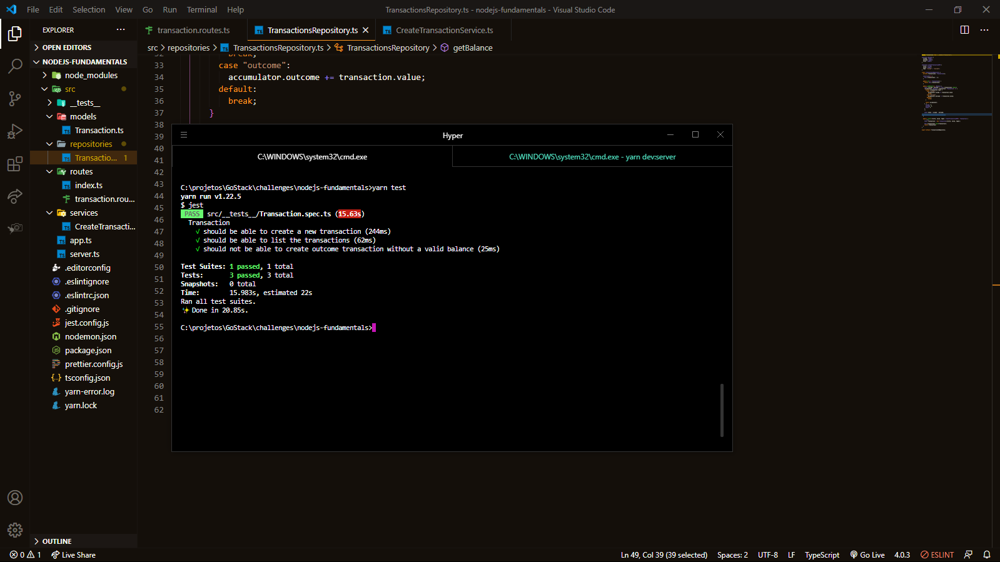

_English_

# Node.js Fundamentals

🚀 About the challenge

The objective of this challenge was to create an application to continue training what I am learning with Node.js together with TypeScript, using the concept of models, repositories and services!

The application should be able to create a transaction, list transactions and should not be able to create a profit and loss transaction without a valid balance.

`Screenshot of tests`

---

_Português_

# Fundamentos Node.js

🚀 Sobre o desafio

O objetivo desse desafio era criar uma aplicação para continuar treinando o que estou aprendendo com Node.js junto ao TypeScript, utilizando o conceito de models, repositories e services!

A aplicação deveria ser capaz de criar uma transação, listar transações e não deveria ser capaz de criar uma transação de resultado sem um saldo válido.

`Captura de tela dos testes`

